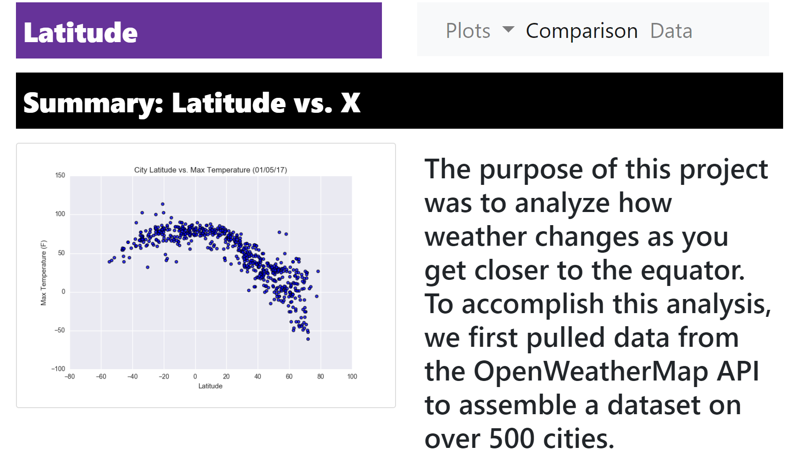
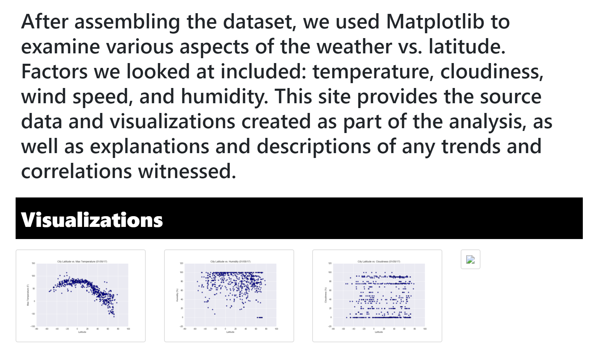
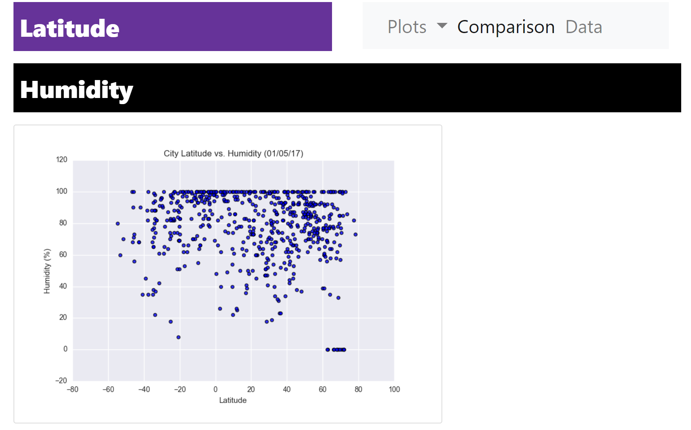
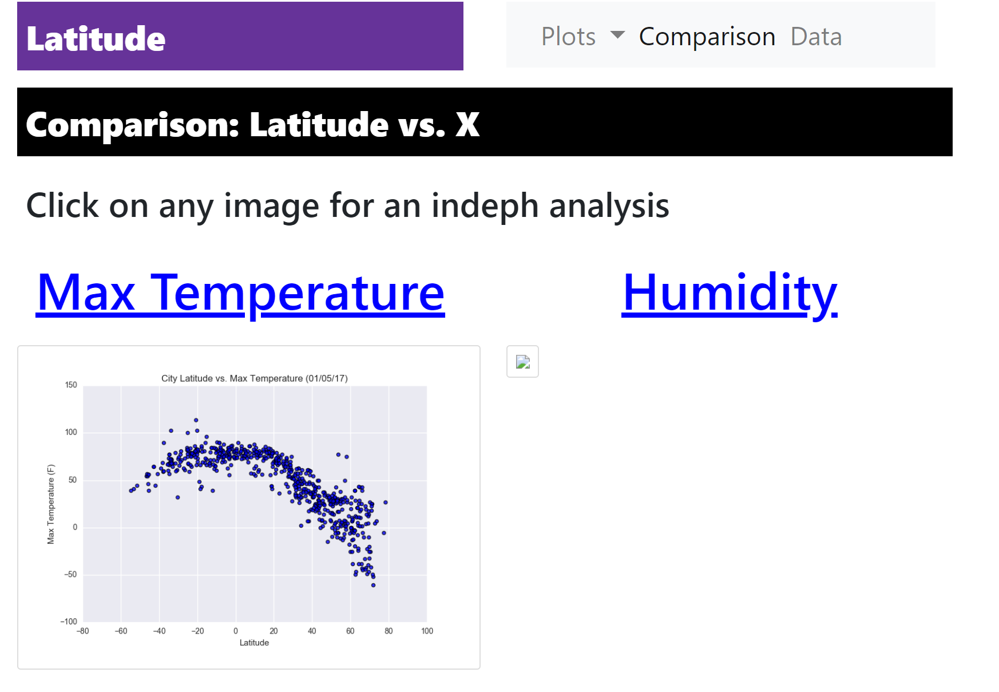
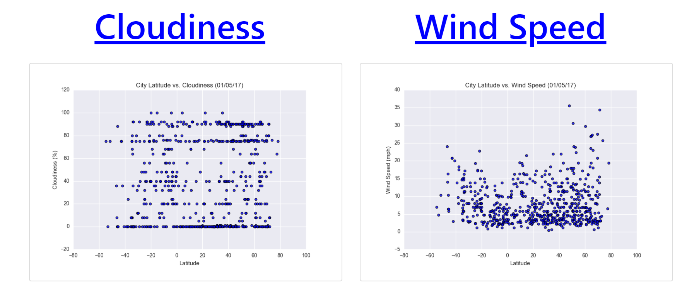
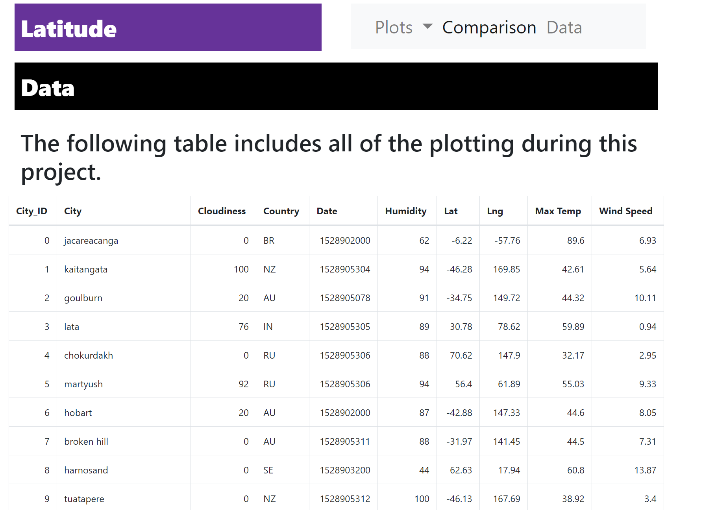

# Web Visualiztion Dashboard

## Installation

Windows, OS X & Linux:

* Web Development IDE
* Access to github pages

## Usage example

## Development setup

* [14 Best Web Development IDEs](https://tms-outsource.com/blog/posts/web-development-ide/)
* [GitHub Pages Instructions](https://guides.github.com/features/pages/)

## Meta

Noah Stettler – noahstettler@gmail.com

[github-link](https://github.com/noahstettler)

